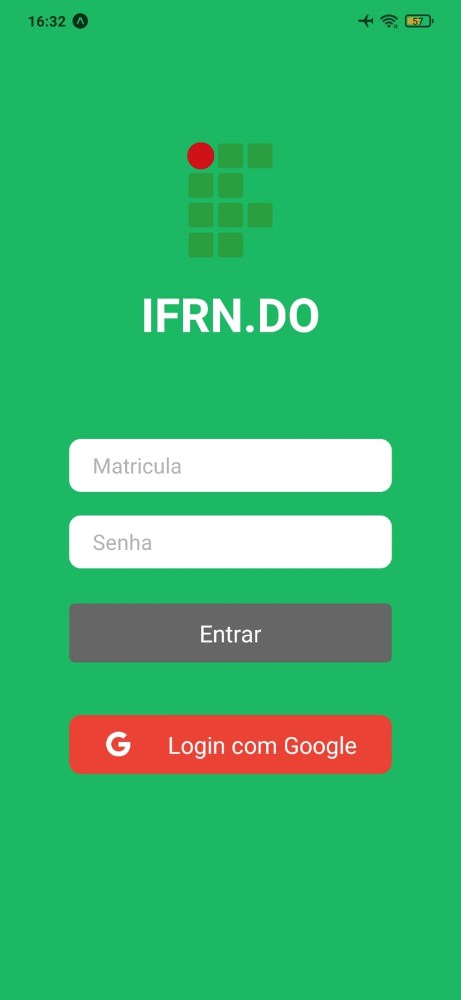
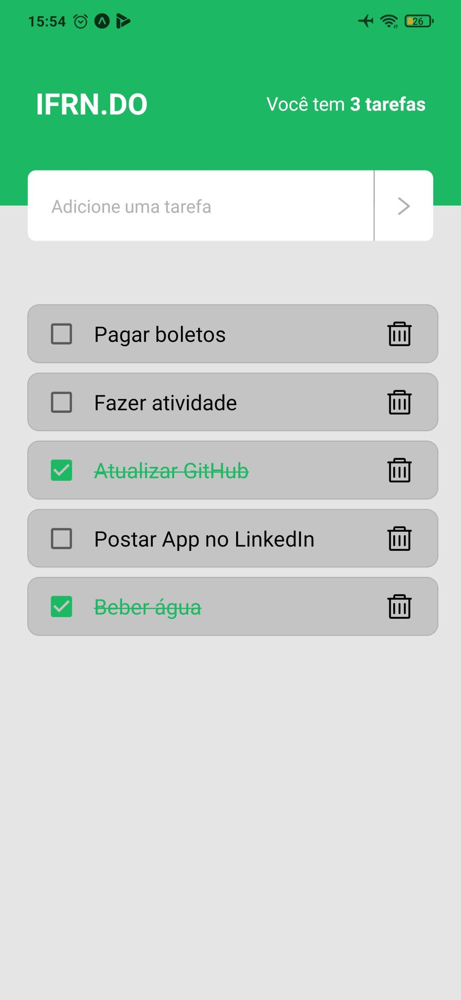

# IFRN.DO

App "IFRN.DO" desenvolvido para a disciplina de Desenvolvimento para Dispositivos Móveis.  
* O login no App é feito usando a API do SUAP.  
* Após ser autenticado o usuário pode adicionar tarefas que precisa executar e ao clicar no Checkbox ela ficar marcada como executada e também é possível excluir uma tarefa.  
* Na parte superior mostra o total de tarefas que têm para serem executadas.

##

### Telas:

  
  

